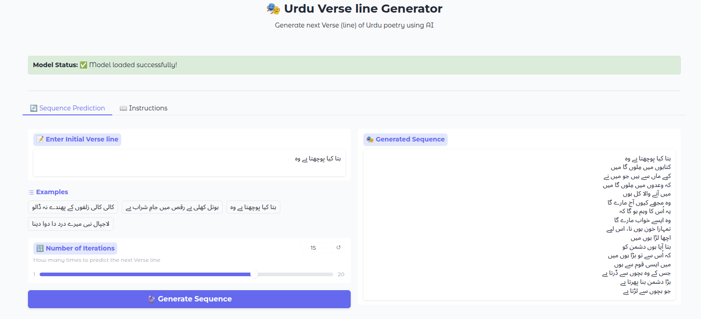
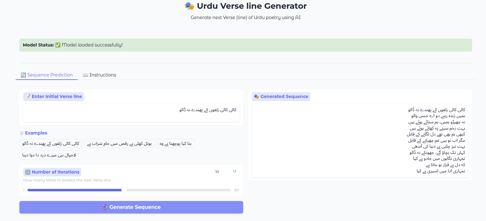
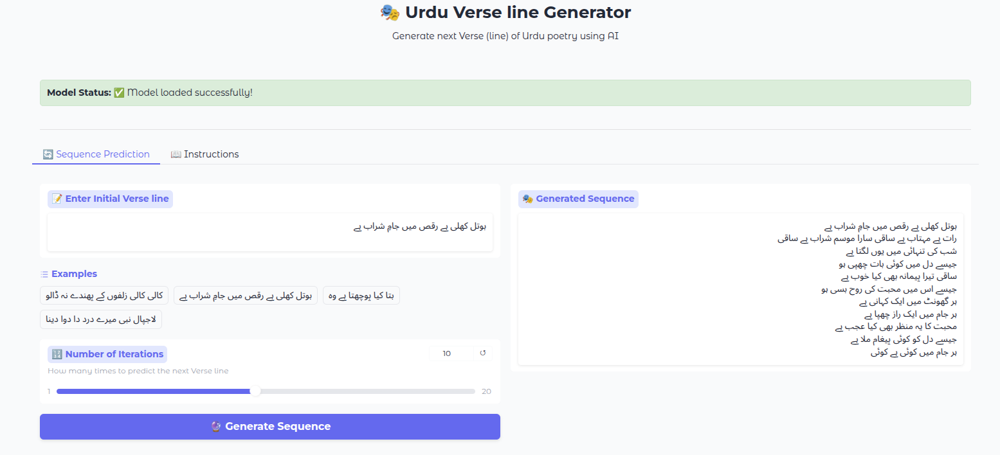

# 🎭 Urdu Verse Line Generator using Luong Attention

A deep learning-based sequence generation model that generates Urdu poetry (verse lines) using Luong Attention mechanism in an Encoder-Decoder LSTM architecture. This model learns poetic structure from a dataset of **Milli Naghmay & Qawali's** and generates next lines given a starting verse.

## 📌 Features

- Seq2Seq architecture with Luong-style attention
- Trained on Urdu national songs (Milli Naghmay)
- Web interface using Gradio
- Generates next verse(s) based on input line
- CLI and web-based prediction
- Clean modular codebase (train, predict, evaluate)

---

## 🗂️ Project Structure

```
Luong_Attention_Udru_task/
├── app.py                     # Gradio web interface
├── main.py                    # Entry point for training, prediction, data creation
├── models/                    # Encoder, Decoder, Attention, train and predict scripts
├── utils/                     # Preprocessing, vocabulary handling, helpers
├── dataset/                   # Raw .txt files of milli naghme (each line is a masra)
├── data/                      # Processed train/val/test CSVs and vocab files
├── trained/                   # Trained PyTorch model (.pt)
├── images/                    # Training loss plot
└── README.md
```

---

## ⚙️ Installation

```bash
git clone https://github.com/Bilal-javed-goraya-ml/Urdu_verse_line_generator.git
cd Urdu_verse_line_generator

# (Recommended) Create and activate a virtual environment
conda create -n env python=3.12 -y
conda activate env

# Install dependencies

pip install torch torchvision torchaudio --index-url https://download.pytorch.org/whl/nightly/cu121
pip install -r requirements.txt
```

---

## 🧠 Training the Model

1. **Prepare the dataset (split + vocab):**

```bash
python main.py --mode data-builder
```

2. **Train the model:**

```bash
python main.py --mode train
```

> Trained model will be saved in `trained/model.pt`

---

## 🔮 Predict from CLI

```bash
python main.py --mode predict
```

You will be prompted to enter a verse line in Urdu. The model will generate the next line(s) interactively.

---

## 🌐 Run Web App (Gradio)

```bash
python app.py
```

This will launch a beautiful Gradio interface at `http://localhost:1102` where you can:

- Enter an initial verse
- Select number of iterations (lines to generate)
- Get poetic continuation generated by the model

---

## 📊 Sample Output

Input:
```
کالی کالی زلفوں کے پھندے نہ ڈالو
```

Generated:
```
ہمیں زندہ رہنے دو اے حسن والو
نہ چھیڑو ہمیں، ہم ستائے ہوئے ہیں
بہت زخم سینے پہ کھائے ہوئے ہیں
```

---

## 📈 Visuals

<p align="center">
  
</p>

<p align="center">
  
</p>

<p align="center">
  
</p>

---

## 🛠️ Customization

- Add more `.txt` files of Urdu poems/songs in `dataset/`
- Run `data-builder` mode again
- Retrain model for better results

---

## ❤️ Credits

Developed with passion for Urdu poetry 🇵🇰

> Inspired by the beauty and rhythm of **Milli Naghmay & Qawali's** and the creativity of AI.

## 📜 License

MIT License. Feel free to use and modify for educational or research purposes.